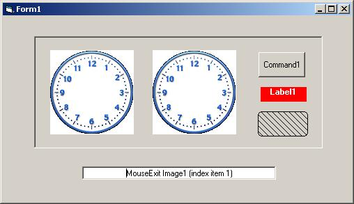



## Mouse Enter/Exit for all controls \(including those without  handles\)

### Description

This program improves on the work presented by Evan Toder regarding the capture of Mouse Enter and Exit events.

This version will capture events from all controls on a form - including those without hwnd properties (such as labels, images etc).

The program can also handle control arrays, and controls that are nested in containers.

You also have the ability to choose which controls have their mouse enter/exit events reported.  Mousewheel events have also been added.
 
### More Info
 
In order for monitoring to take place you must put a "Skinned" label in the control's tag field.

MouseEnter, MouseExit, MouseWheelUp and MouseWheelDown Events are generated.

This program uses subclassing so care should be taken in how it's applied. If you don't like subclassing the program is easily modifield to using a timer field.

             |
---                |---
**Submitted On**   |2004-10-23 08:52:04
**By**             |[Phobos](https://github.com/Planet-Source-Code/PSCIndex/blob/master/ByAuthor/phobos.md)
**Level**          |Advanced
**User Rating**    |5.0 (25 globes from 5 users)
**Compatibility**  |VB 6\.0
**Category**       |[Coding Standards](https://github.com/Planet-Source-Code/PSCIndex/blob/master/ByCategory/coding-standards__1-43.md)
**World**          |[Visual Basic](https://github.com/Planet-Source-Code/PSCIndex/blob/master/ByWorld/visual-basic.md)
**Archive File**   |[Mouse\_Ente18092210232004\.zip](https://github.com/Planet-Source-Code/phobos-mouse-enter-exit-for-all-controls-including-those-without-handles__1-56881/archive/master.zip)

